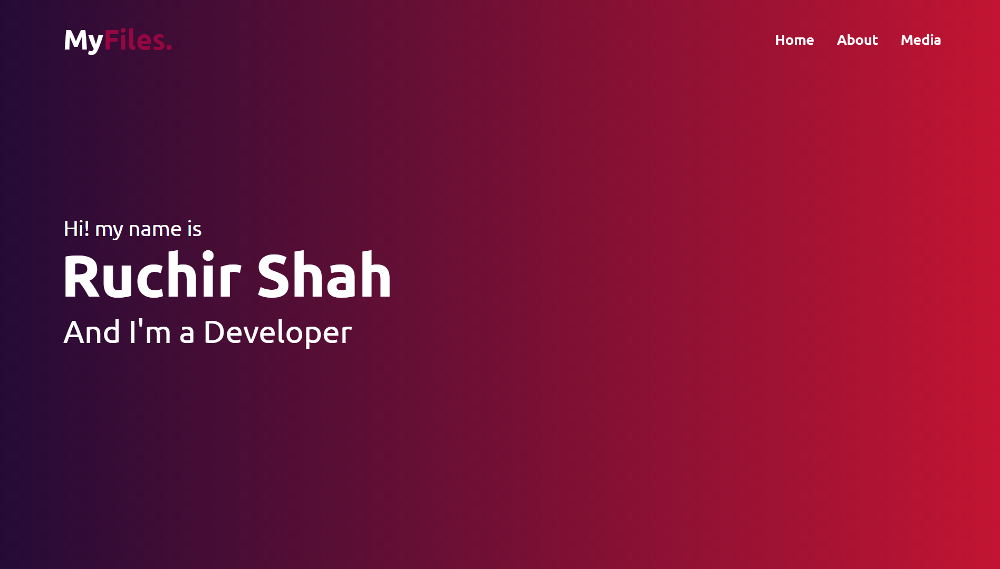

# My-Files
Repository for hosting files.

 **Repository for hosting files. I've created this website to use my files as global so I can access them for testing and demonstration purposes.**

Hi! 👋🏻 my name is Ruchir. I'm a web developer and designer and I like my privacy. I've created this website for everyone to create new passwords and check the passwords stremgth. You can create 32 characters long passwords which includes upper, lower, special characters, and numbers. Passwords strength checker inform you that the password is weak or strong.

Visit the site from here 👉🻠[MyFiles](https://theruchirshah.github.io/My-Files)  
It is Completely Responsive site. You can view the site on any device Mobile, Tablet, Laptop, Desktop.

#### Files Format Included :
 - Image 🖼️
 - Audio 🎵
 - Video 🎬
 - Document 📄
